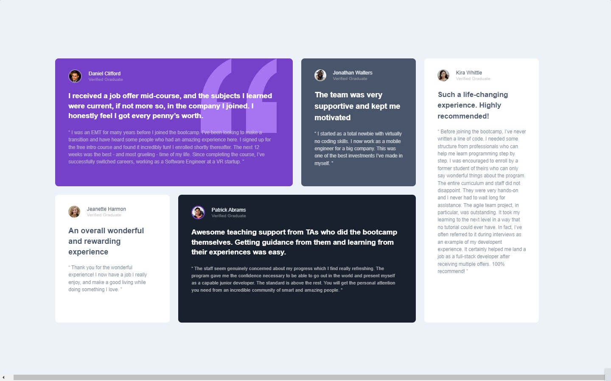
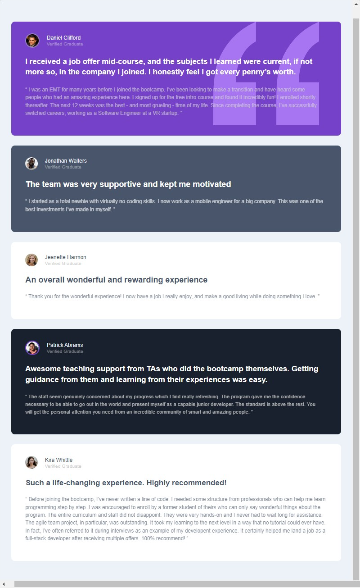
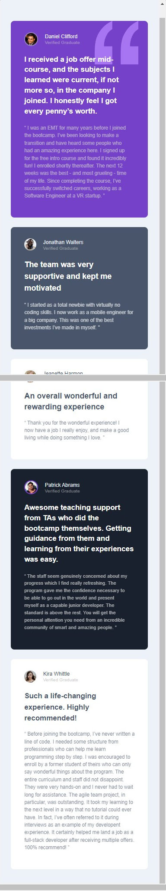

# Frontend Mentor - testimonials-grid-section
Esta é uma solução para o [testimonials-grid-section](https://www.frontendmentor.io/challenges/testimonials-grid-section-Nnw6J7Un7). Os desafios do Frontend Mentor ajudam você a melhorar suas habilidades de codificação ao construir projetos realistas.

## Resumo de conteúdos

- [Visão Geral](#Visão-Geral)
  - [O desafio](#O-desafio)
  - [Captura de tela](#Captura-de-tela)
  - [Links](#Links)
- [Meu processo](#Meu-processo)
  - [Construído com](#Constrído-com)
  - [O que eu aprendi](#O-que-eu-aprendi)
  - [Continuação dos desenvolvimentos](#Continuação-dos-desenvolvimentos)
  - [Recursos utilizados](#Recursos-utilizados)
- [Autor](#Autor)

## Visão Geral.

### O desafio

Os usuários devem ser capazes de:

- Observar um design responsivo.
- Diferença de cores e posições dos cards.

### Captura de tela

- Desktop
<p  align="center" >
  
</p>

- Tablet
<p  align="center" >

</p>

- Mobile
<p  align="center" >

</p>

- Gif
<p  align="center" >

</p>

### Links

- Solução URL: [https://github.com/michelwene/testimonials-grid-section](https://github.com/michelwene/testimonials-grid-section)
- Site URL: [https://michelwene.github.io/testimonials-grid-section/](https://michelwene.github.io/testimonials-grid-section/)

## Meu processo

### Construído com

- HTML5
- CSS3
- Flexbox
- Grid
- Design responsivo
- EMMET

### O que eu aprendi

```css
html {
  box-sizing: border-box;
  font-size: 65%;
  height: 100%;
}

.app {
  background-color: var(--azul-acizentado-claro);
  display: flex;
  font-family: "Barlow", sans-serif;
  justify-content: center;
  max-width: 100vw;
  min-height: 100%;
  padding: 0 2.4rem 2.4rem 2.4rem;
}

.content {
  
  max-width: 100vw;
  overflow: hidden;
}

@media screen and (min-width: 820px) {
  .app {
    align-items: center;
    max-width: 1400px;
    height: 27.7rem;
    padding: 0;
  }

  .content {
    overflow: unset;
  }
}


/*conceito de mobile-first aplicado no projeto.*/
```

### Continuação dos desenvolvimentos

Pretendo continuar fazendo projetos do FrontendMentor, para melhorar meu HTML, CSS, JavaScript.

### Recursos utilizados

- [grid.layoutit](https://grid.layoutit.com/) - Site utilizado para fazer os template do css grid.
- [PerfectPixel](https://www.welldonecode.com/perfectpixel/) - Plugin do google Chrome utilizado para servir de refência na construção do layout, funciona mais ou menos como um FIGMA.

## Autor

- Frontend Mentor - [@michelwene](https://www.frontendmentor.io/profile/michelwene)
- Linkedin - [@michelwene](https://www.linkedin.com/in/michelwene/)
